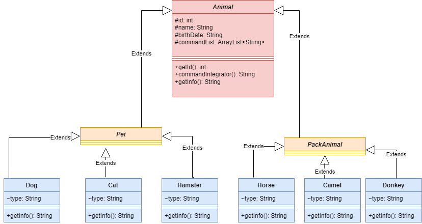

# ANIMAL RESIDENCE |  ТОГОЧАКОВА ЕВГЕНИЯ ВЯЧЕСЛАВОВНА  | 14.12.2023  | 4544

## Операционные системы и виртуализация (Linux)

[История команд в терминале Linux, включая sql-запросы](./Linux_animals_terminal_history.txt)

## MySQL

[Чистый MySQL](./pets_pack_animals.sql)

## Диаграмма классов Java

## Система учета для питомника, в котором живут домашние и вьючные животные

[Code](./src/main/java/AnimalResidence.java)
